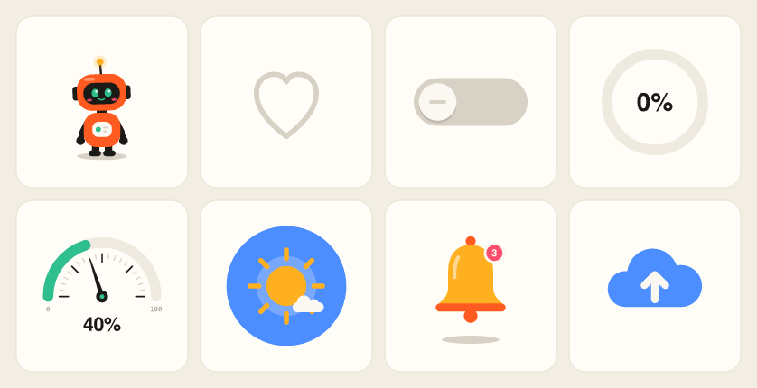
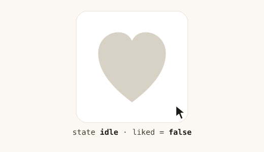
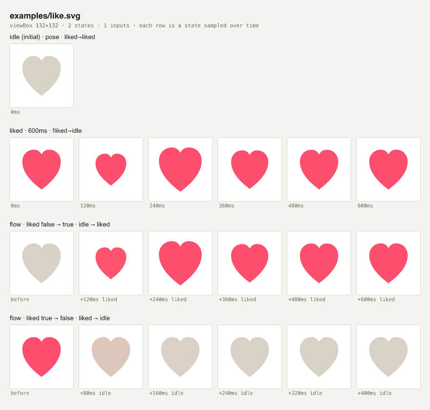

# Motion Forge

**Animations your agent can write, see, and ship.**

[Website](https://motion-forge-dev.vercel.app) · [Playground](https://motion-forge-dev.vercel.app/playground/) · [Docs](https://motion-forge-dev.vercel.app/docs/) · [Presets](https://motion-forge-dev.vercel.app/#presets)

Motion Forge makes interactive animation plain text. A *Motion SVG* is an ordinary SVG with a small JSON block describing states, keyframes, springs, morphs, inputs and interactions. Coding agents write it, the CLI turns motion into things a model can read (diagnostics, element maps, frame-by-frame contact sheets), and a ~31 KB runtime plays it on the web.



<sub>Every frame above was rendered by Motion Forge’s own engine from the files in [`presets/`](packages/motion-forge/presets), driven by scripted events and inputs.</sub>

## Why this exists

Agents can already write animation code. The hard part is checking what that code does across states, interruptions and changing data. Motion Forge combines editable SVG artwork, declarative behavior and visual checks in an MIT toolchain that runs locally without an account.

Motion Forge is built around the agent’s loop:

| Step | What happens |
| --- | --- |
| **Write** | Plain SVG plus JSON: states, keyframes, easing, inputs, bindings, interactions. Import supported vector artwork from Figma, Illustrator or icon sets; sanitization reports removed content. |
| **Check** | `motion-forge check` validates everything and lints motion: loop seams, clipping, layer conflicts, dead states, no-op tracks, with JSON paths and “did you mean”. |
| **See** | `motion-forge preview` renders a contact sheet: every state over time, every event and toggle played through the real state machine, and input sweeps. `record` scripts clicks and data into a frame grid, GIF or MP4. |
| **Ship** | `<motion-forge src="like.svg">`, `<MotionForge svg={…}>` in React (with SSR), or `mount(el, svg)`. Events and inputs are the API. |

## Quick start

```sh
npx motion-forge init                 # installs the agent skill + an AGENTS.md note
npm i motion-forge
```

Then ask your agent for what you want: “a like button that pops”, “make our mascot wave when the upload finishes”, “a gauge for CPU usage in our brand colors”. The skill tells it to start from a preset or a template, check, look at the preview, and iterate.

Doing it by hand:

```sh
npx motion-forge list                          # 23 presets: characters, feedback, controls, loaders, data…
npx motion-forge add like --dir src/motion     # copy one into your project
npx motion-forge check src/motion/like.svg
npx motion-forge preview src/motion/like.svg   # writes a PNG contact sheet
npx motion-forge dev src/motion/like.svg       # live preview with controls, reloads on save
```

## The format in one screen

This is a complete, working like button ([`examples/like.svg`](examples/like.svg)):

```xml
<svg xmlns="http://www.w3.org/2000/svg" viewBox="34 38 132 132">
  <title>Like button</title>
  <path id="heart" d="M100 146 C94 141 60 118 60 88 C60 73 71 63 84 63 C92 63 97 67 100 73 C103 67 108 63 116 63 C129 63 140 73 140 88 C140 118 106 141 100 146 Z" fill="#d8d2c6"/>
  <metadata type="application/motion+json"><![CDATA[
  {
    "inputs": { "liked": false },
    "states": {
      "idle": {
        "animate": { "#heart": { "fill": "#d8d2c6" } },
        "when": { "liked": "liked" }
      },
      "liked": {
        "duration": 600,
        "animate": {
          "#heart": {
            "fill": "#ff4d6d",
            "scale": { "0%": 1, "20%": 0.8, "55%": 1.3, "100%": { "value": 1, "ease": "spring-bouncy" } }
          }
        },
        "emit": "liked",
        "when": { "!liked": "idle" }
      }
    },
    "interactions": [{ "on": "click", "target": "#heart", "toggle": "liked" }]
  }
  ]]></metadata>
</svg>
```



<sub>That file, clicked twice, rendered by Motion Forge’s own engine.</sub>

Two states and one input. A click toggles `liked`; the `when` rules move between `idle` and `liked`. Entering `liked` blends the fill to pink, runs the scale keyframes (squash to 0.8, overshoot to 1.3, settle to 1 on a bouncy spring), and emits `liked` to your app. Clicking again switches back to `idle`, which blends to grey from whatever is on screen, so fast repeated clicks never jump.

Without the runtime it’s a plain grey heart that renders anywhere SVG does (GitHub, Figma, ``). With the runtime it’s a keyboard-accessible button.

A model can’t watch a GIF, so `motion-forge preview examples/like.svg` gives it this instead: each state sampled over time, then each input change played through the real state machine.



What the format covers: state machines with events, conditions and `next`; parallel layers (blink while waving); springs and 20+ easings; stagger; smooth curves through keyframes; path morphing between any shapes; stroke drawing; OKLab color blends; input bindings with maps, text templates and spring smoothing; click, hover, press, pointer-follow, drag (keyboard-accessible) and scroll-into-view interactions. Full reference: [`skills/motion-forge/reference.md`](packages/motion-forge/skills/motion-forge/reference.md).

## Using it in an app

```html
<motion-forge src="/like.svg" inputs='{"liked": true}'></motion-forge>
<script type="module">
  import 'https://cdn.jsdelivr.net/npm/motion-forge/dist/element.js';
  const like = document.querySelector('motion-forge');
  like.addEventListener('emit', e => console.log(e.detail.name)); // "liked"
</script>
```

```tsx
import { MotionForge } from 'motion-forge/react';
import like from './like.svg?raw';

<MotionForge svg={like} inputs={{ liked }} onEvent={e => e.type === 'emit' && track(e.name)} />;
```

```js
import { mount } from 'motion-forge';
const anim = mount(document.querySelector('#slot'), svgText);
anim.send('wave');
anim.set('progress', 72);
```

The runtime respects `prefers-reduced-motion`, pauses offscreen, isolates instances (ids are prefixed, Shadow DOM for the web component), and settles into the right state for the initial inputs without replaying transitions.

## For agents and tools

- **Skill:** `npx motion-forge init` copies [`SKILL.md`](packages/motion-forge/skills/motion-forge/SKILL.md) and the reference into `.claude/skills/`, and adds a note to `AGENTS.md` for Cursor, Codex and friends.
- **MCP:** `{ "command": "npx", "args": ["motion-forge", "mcp"] }` exposes `motion_docs`, `motion_presets`, `motion_check`, `motion_inspect`, `motion_preview` and `motion_render` (these return images), and `motion_record`.
- **CLI:** every command prints text an agent can act on; `--json` where structure helps. `check --strict` also fails on warnings for CI. `motion-forge docs` prints the full reference.
- **Playground:** open an SVG, edit it live, pause/scrub/restart its main state, inspect an event log, and share or download it. Drafts save locally in your browser.
- **Web:** the site serves `llms.txt`, `llms-full.txt`, `reference.md` and `presets.json`.

## How it compares

| | Motion Forge | Lottie | Rive |
| --- | --- | --- | --- |
| Source | SVG + JSON text | Lottie JSON / dotLottie | RML text; `.riv` runtime files |
| Interactive states | Built in | dotLottie extension | Built in |
| Authoring | Your agent, your editor, the playground | After Effects / Lottie Creator / JSON tooling | Rive editor or CLI |
| Visual verification | Lint, state/flow sheets, scripted recordings | Player / browser tooling | CLI capture, simulated inputs, script tests |
| Web runtime, gzip (JS + wasm) | ~31 KB | 76 KB lottie-web; 532 KB dotLottie with state machines | 916 KB `@rive-app/canvas` |
| License | MIT | MIT runtime | MIT runtime, closed editor |

Agent authoring and verification are not exclusive to Motion Forge: see the [Rive CLI](https://rive.app/docs/cli/overview) and [dotLottie interactivity](https://docs.lottiefiles.com/en/format/dotlottie/interactivity). Choose it for the combination of ordinary SVG, MIT tooling and a small web runtime. It does not import/export Lottie or Rive files, and the playground scrubber is not a visual keyframe editor. Sizes are what a browser downloads (JS plus WebAssembly), measured from pinned npm packages (lottie-web 5.13.0, dotlottie-web 0.80.0, @rive-app/canvas 2.43.1) in [`docs/size.json`](docs/size.json); reproduce with `pnpm size:compare`. They are download sizes, not a rendering-performance benchmark: Rive's larger runtime buys a GPU/canvas renderer, bones and a full editor ecosystem.

## Develop

```sh
pnpm install
pnpm dev            # builds the package, runs the site at http://127.0.0.1:4176
pnpm check          # build + typecheck + unit tests
pnpm check:presets  # every preset passes check
pnpm test:e2e       # Playwright + accessibility checks against the production build
pnpm verify:package # pack, install into a clean project, exercise every entry point + CLI
```

Layout: `packages/motion-forge` (engine, runtime, React, CLI, presets, skill) and `apps/site` (landing page, playground, docs; static, prerendered, Vercel-ready).

## Status

v0.2, pre-release: not yet published to npm, site not yet deployed. See [STATUS.md](STATUS.md) for what’s verified and what’s next.

## License

[MIT](LICENSE)
