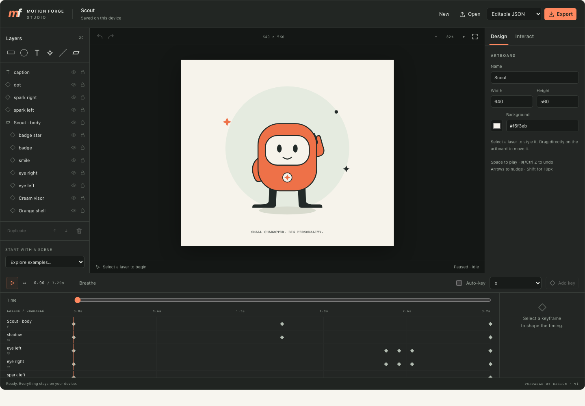

# Motion Forge

**Make it move. Make it yours.**

An open-source toolkit for interactive vector animation. Author visually in Studio, edit the portable JSON with code or an agent, and play it in React or your own JavaScript host. No account, cloud dependency, or model API.


## What’s inside

- **Studio:** layers, direct manipulation, keyframes, easing curves, states, typed inputs, property bindings, undo/redo and local recovery.
- **Runtime:** deterministic sampling, manual clock, loops, reverse playback and interruptible state blends.
- **React:** SVG player, imperative controls, callbacks, reduced motion, SSR and visibility-aware clock lifecycle.
- **Interchange:** editable JSON, an explicit SVG import subset, static SVG/PNG frames and React component export.
- **CLI:** validate, inspect, sample, render, schema and editable presets, with structured diagnostics.
- **Original examples:** Scout (character), Made it (interface feedback), Signal (data-driven instrument).

The initial release is built and verified locally: 73 package tests, 13 production browser journeys, a clean-checkout build, and packed consumers on React 18/19. It has not been published or deployed. See the [verification report](docs/VERIFICATION.md) and [release checklist](RELEASE.md) for evidence, limitations, and publication steps.

## Run the project

Use Node 22 or 24 and pnpm 11.

```sh
pnpm install
pnpm build:package
pnpm dev
```

Open `http://127.0.0.1:4176` for the site and `/studio/` for the editor. The package build creates the exports that the demo app consumes.

## Use the package

After publication, install with `npm install motion-forge`. Before publication, build and install the tarball produced by `pnpm --filter motion-forge pack`.

```tsx
import { MotionForge } from 'motion-forge/react';
import { createPreset } from 'motion-forge/presets';

const animation = createPreset('scout');

export default function Welcome() {
  return <MotionForge
    document={animation}
    title="A friendly explorer"
    style={{ width: '100%', maxWidth: 480 }}
  />;
}
```

Keep the document reference stable. Use a `MotionForgeHandle` ref to call `play`, `pause`, `seek`, `send`, `setState` and `setInput`. React entrypoints support React 18 and 19; core/CLI do not require React.

```tsx
import { useRef } from 'react';
import { MotionForge, type MotionForgeHandle } from 'motion-forge/react';
import { createPreset } from 'motion-forge/presets';

const scout = createPreset('scout');

export function InteractiveScout() {
  const player = useRef<MotionForgeHandle>(null);
  return <>
    <MotionForge ref={player} document={scout} />
    <button onClick={() => player.current?.send('wave')}>Say hello</button>
  </>;
}
```

Embed the complete editor separately:

```tsx
import { ForgeStudio } from 'motion-forge/studio';
import 'motion-forge/studio.css';

export default function Editor() {
  return <ForgeStudio storageKey="my-app:scene:v1" />;
}
```

Or use the engine in Node:

```js
import { ForgePlayer, renderSVG } from 'motion-forge';
import { createPreset } from 'motion-forge/presets';

const document = createPreset('scout');
const player = new ForgePlayer(document, { autoplay: true });
player.advance(800);
const svg = renderSVG(document, { frame: player.getSnapshot().frame });
player.dispose();
```



## Agent-friendly by design

```sh
motion-forge preset scout --output scout.forge.json
motion-forge validate scout.forge.json
motion-forge inspect scout.forge.json
motion-forge sample scout.forge.json --time 800
motion-forge render scout.forge.json --time 800 --output scout.svg
```

The document is versioned and validated. The CLI accepts stdin, produces structured JSON diagnostics, and runs without network access. The npm package includes an [agent skill](packages/motion-forge/skills/motion-forge/SKILL.md). The static docs build generates `llms.txt`, `llms-full.txt` and a structural JSON Schema; semantic validation still runs in the actual parser.

## Documentation

[Quickstart](docs/quickstart.md) · [API](docs/api.md) · [Document format](docs/format.md) · [Studio](docs/studio.md) · [Import/export](docs/interchange.md) · [Agents/CLI](docs/agents.md) · [Accessibility](docs/accessibility.md) · [Performance](docs/performance.md) · [Troubleshooting](docs/troubleshooting.md)

## Scope

Motion Forge focuses on editable vector scenes, keyframes and application-driven interaction. SVG import supports basic shapes, groups, text and translate/rotate/scale, with explicit diagnostics for unsupported features. It does **not** claim arbitrary SVG fidelity, Rive/Lottie compatibility, path morphing, skeletal rigs, bitmap/video/audio animation or font shaping. Exported SVG/PNG files are static frames; JSON preserves animation and behavior.

## Verify and contribute

```sh
pnpm check
pnpm exec playwright install chromium
pnpm test:e2e
```

`pnpm check` builds, typechecks and runs package tests. Browser tests cover actual editing journeys and exported results. See [CONTRIBUTING.md](CONTRIBUTING.md), [SECURITY.md](SECURITY.md), [SUPPORT.md](SUPPORT.md) and [RELEASE.md](RELEASE.md).

The demo/docs site is a static build, prepared for Vercel through the root `vercel.json`. See [deployment instructions](DEPLOYMENT.md). Building does not publish or deploy anything.

## License

[MIT](LICENSE). The original preset artwork and project-authored docs share that license. Dependency licenses remain their respective authors’ licenses; see [THIRD_PARTY.md](THIRD_PARTY.md).
